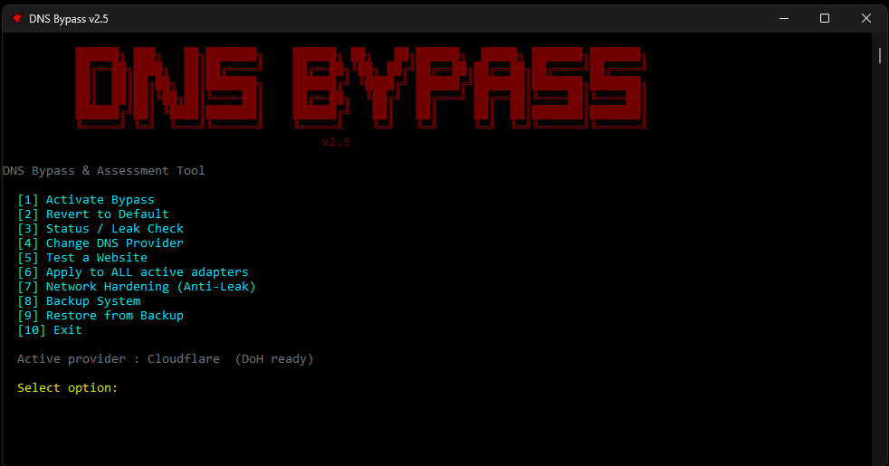

# 🛡️ DNS Bypass - Advanced Network Security Tool

<div align="center">
  


[](https://www.microsoft.com/windows)
[](https://dotnet.microsoft.com/)
[](LICENSE)

</div>

---

**DNS Bypass** is an advanced network security assessment tool for Windows that provides DNS-based filtering bypass capabilities combined with comprehensive network hardening features.

> ⚠️ **Legal Notice**: This tool is designed for authorized security testing, network administration, and educational purposes only. Unauthorized use to bypass network restrictions may violate laws and policies.

---

## ✨ Features

### 🔒 Network Hardening (Anti-Leak)
- **NetBIOS Disable**: Prevents NetBIOS over TCP/IP leaks
- **IPv6 Transitions**: Disables Teredo, ISATAP, 6to4, IP-HTTPS
- **DNS Cache Optimization**: Configures negative TTL and cache limits
- **NCSI Prevention**: Blocks Windows Network Connectivity probes
- **DNS Client Hardening**: Enforces DoH, disables LLMNR/multicast

### 🌐 DNS Management
- **Multi-Provider Support**: Cloudflare, Google, Quad9, OpenDNS, AdGuard, and more
- **DNS-over-HTTPS (DoH)**: Encrypted DNS queries
- **Custom DNS**: Support for user-defined DNS servers
- **Automatic Verification**: Post-activation DNS connectivity tests
- **Multi-Adapter**: Apply settings to all network adapters

### 💾 Backup & Restore
- **System Snapshots**: Complete registry + DNS state backup
- **JSON Storage**: Human-readable backup format
- **One-Click Restore**: Revert all changes safely
- **Snapshot Management**: List, view, and delete backups

### 🎯 User Interface
- **Interactive Menu**: Easy-to-use console interface
- **CLI Support**: Scriptable command-line operations
- **Colored Output**: Status indicators and progress feedback
- **Real-time Logging**: Detailed operation logs

---

## 📋 Requirements

- **OS**: Windows 10 (64-bit) or later
- **Runtime**: .NET 10.0 Runtime (included in self-contained build)
- **Privileges**: Administrator rights required
- **Hardware**: Hardware-locked to authorized devices (MAC-based)

---

## 🚀 Quick Start

### Download & Run

1. Download the latest `DNS Bypass.exe` from [Releases](../../releases)
2. Right-click → **Run as Administrator**
3. Choose your DNS provider (default: Cloudflare)
4. Select **[1] Activate Bypass**

### Menu Options

```
  [1] Activate Bypass              - Apply DNS bypass to selected adapter
  [2] Revert to Default            - Restore original DNS settings
  [3] Status / Leak Check          - Check current DNS configuration
  [4] Change DNS Provider          - Switch between DNS providers
  [5] Test a Website               - Verify connectivity to a domain
  [6] Apply to ALL active adapters - Apply DNS to all active adapters
  [7] Network Hardening (Anti-Leak)- Apply comprehensive leak prevention
  [8] Backup System                - Create system state snapshot
  [9] Restore from Backup          - Restore from previous snapshot
  [10] Exit                        - Close the application
```

---

## 🛠️ Building from Source

### Prerequisites

- [.NET 10.0 SDK](https://dotnet.microsoft.com/download/dotnet/10.0)
- Git
- Windows 10+ (64-bit)

### Build Steps

```bash
# Clone repository
git clone https://github.com/YOUR_USERNAME/DNS-Bypass.git
cd DNS-Bypass

# Restore dependencies
dotnet restore

# Build (Debug)
dotnet build -c Debug

# Build (Release)
dotnet build -c Release

# Publish single-file executable
dotnet publish -c Release -r win-x64 --self-contained true -p:PublishSingleFile=true

# Output: bin\Release\net10.0-windows\win-x64\publish\DNS Bypass.exe
```

---

## 📖 Usage Examples

### CLI Mode

```powershell
# Activate bypass (auto-select adapter)
.\DNS` Bypass.exe --activate

# Activate on specific adapter
.\DNS` Bypass.exe --activate --adapter "Wi-Fi"

# Apply to all adapters
.\DNS` Bypass.exe --activate --all

# Change provider and activate
.\DNS` Bypass.exe --provider Cloudflare --activate

# Check status
.\DNS` Bypass.exe --status

# Revert changes
.\DNS` Bypass.exe --revert
```

---

## 🏗️ Architecture

### Modular Design

```
DNS-Bypass/
├── Core/
│   ├── Interfaces/       (ILogger, IRegistryManager, IBackupService, etc.)
│   ├── Models/           (SystemSnapshot, DnsBackup, AppConfiguration, etc.)
│   ├── Helpers/          (SafeRegistryHelper, ProcessHelper)
│   └── Services/         (NetworkHardener, BackupService, RestoreService)
└── Program.cs            (Entry point & UI)
```

### Key Components

- **SafeRegistryHelper**: Thread-safe Windows Registry operations
- **NetworkHardener**: DNS leak prevention and hardening
- **BackupService**: System state snapshot management
- **RestoreService**: Safe restoration with validation
- **ConfigurationService**: JSON-based configuration

---

## 🔐 Security Considerations

### What This Tool Does

✅ Changes DNS server settings (reversible)  
✅ Modifies registry values for hardening (backed up)  
✅ Restarts DNS Client service  
✅ Flushes DNS cache  

### What This Tool Does NOT Do

❌ Install kernel drivers  
❌ Modify system files  
❌ Create network tunnels  
❌ Bypass DPI/TLS inspection  

### Recommendations

- Always create a backup before hardening
- Test DNS connectivity after activation
- Revert changes if experiencing issues
- Use authorized DNS providers only

---

## 🤝 Contributing

Contributions are welcome! Please follow these guidelines:

1. Fork the repository
2. Create a feature branch (`git checkout -b feature/amazing-feature`)
3. Commit your changes (`git commit -m 'Add amazing feature'`)
4. Push to the branch (`git push origin feature/amazing-feature`)
5. Open a Pull Request

---

## 📝 Changelog

See [CHANGELOG.md](CHANGELOG.md) for version history.

---

## 📄 License

This project is licensed under the MIT License - see [LICENSE](LICENSE) file for details.

---

## ⚠️ Disclaimer

This software is provided "as is" without warranty of any kind. The authors are not responsible for any misuse or damage caused by this tool. Always ensure you have authorization before modifying network configurations on any system.

---

## 🙏 Acknowledgments

- Cloudflare, Google, Quad9, OpenDNS for public DNS services
- Microsoft .NET team for excellent tooling
- Open-source community for inspiration

---

## 📧 Contact

- **GitHub Issues**: [Report bugs or request features](../../issues)
- **Author**: [Your Name](https://github.com/YOUR_USERNAME)

---

<p align="center">Made with ❤️ for network security research</p>
